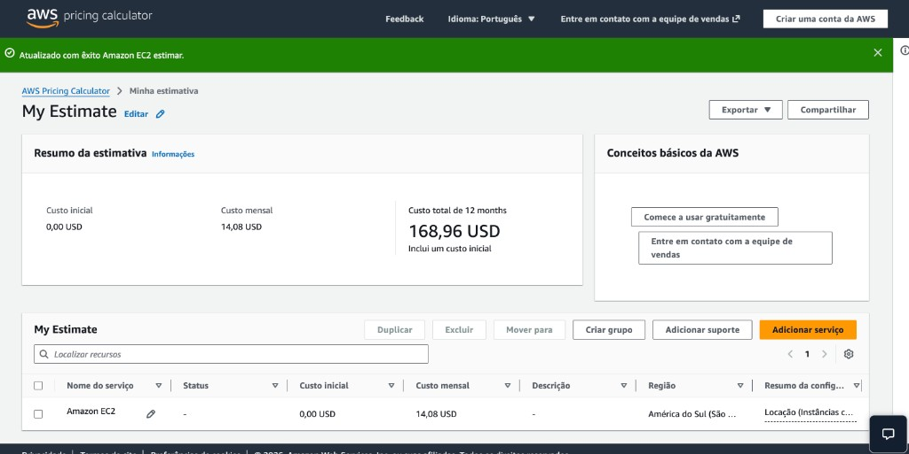
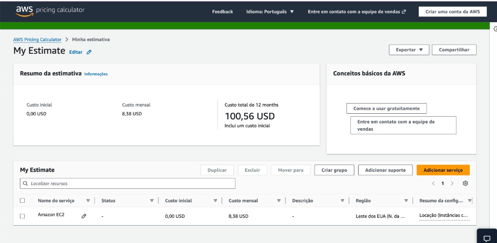

# FarmTech Solutions — Previsão de Rendimento de Safra (Entrega 1)

**FIAP — Graduação em Inteligência Artificial | Fase 5 | PBL**

## Nome do grupo

FarmTech Solutions — Entrega 1

## Integrantes

- Diego Filipe Pereira de Araujo — RM567064

## Professores

- **Tutor(a):** Sabrina Otoni
- **Coordenador(a):** André Godoi Chiovato

---

## Descrição

Projeto da **Entrega 1** (Machine Learning): análise de dados agrícolas da base **crop_yield.csv** (condições de solo e clima) para prever o rendimento de safra. O trabalho inclui análise exploratória (EDA), clusterização (K-Means) para tendências e identificação de outliers, e cinco modelos de regressão (Linear, Ridge, Árvore de Decisão, K-Vizinhos e Floresta Aleatória) com avaliação por métricas (MAE, RMSE, R²).

Todo o passo a passo, resultados e conclusões estão no **notebook Jupyter** indicado abaixo.

---

## Link para o notebook

O desenvolvimento completo da solução está no notebook:

- **Arquivo:** [src/DiegoFilipePereiradeAraujo_rm567064_pbl_fase4.ipynb](src/DiegoFilipePereiradeAraujo_rm567064_pbl_fase4.ipynb)

---

## Vídeos de demonstração

- **Entrega 1:** *(Inserir aqui o link do vídeo de até 5 minutos no YouTube — modo “não listado” — demonstrando o funcionamento do notebook e da solução de ML.)*
- **Entrega 2:** *(Inserir aqui o link do vídeo de até 5 minutos com a comparação de recursos na calculadora AWS.)*

---

## Entrega 2 — Computação em nuvem (AWS)

A máquina de aprendizado de máquina da Entrega 1 será hospedada em uma estrutura de computação em nuvem. A estimativa de custos foi feita com a **calculadora oficial da AWS**, considerando uso **On-Demand (100%)**.

- **Calculadora:** [AWS Pricing Calculator](https://calculator.aws/)
- **Criar estimativa EC2:** [Criar estimativa EC2](https://calculator.aws/#/createCalculator/ec2-enhancement)

### Configuração cotada

| Item | Especificação |
|------|----------------|
| vCPUs | 2 |
| Memória | 1 GiB |
| Rede | Até 5 Gbps |
| Armazenamento | 50 GB (HD / EBS) |
| Sistema operacional | Linux |
| Instâncias | 1 |
| Tipo de uso | On-Demand — 100% |

*Sugestão de tipo de instância na calculadora:* `t4g.micro` ou `t3.micro` (2 vCPU, 1 GiB) + volume EBS de 50 GB.

### Comparação de custos (São Paulo vs Virgínia do Norte)

| Região | Código da região | Custo mensal estimado (USD) | Observação |
|--------|------------------|----------------------------|------------|
| São Paulo (Brasil) | sa-east-1 | 14,08 USD | South America (São Paulo) |
| Virgínia do Norte (EUA) | us-east-1 | 8,38 USD | US East (N. Virginia) |

**Meta 1 — Solução mais barata:** Com os valores cotados na calculadora AWS para a mesma configuração (2 vCPUs, 1 GiB, 50 GB EBS, On-Demand 100%), a região da **Virgínia do Norte (us-east-1)** apresenta o menor custo mensal (**8,38 USD**), enquanto São Paulo (sa-east-1) fica em **14,08 USD**. Portanto, considerando apenas o custo, a solução mais barata é **Virgínia do Norte**. Para o cenário com acesso rápido aos dados e restrições legais (Meta 2), a escolha recomendada continua sendo São Paulo.

### Imagens da calculadora AWS

*Incluir abaixo capturas de tela da calculadora AWS com a estimativa para São Paulo e para Virgínia do Norte.*

| São Paulo (sa-east-1) | Virgínia do Norte (us-east-1) |
|-----------------------|-------------------------------|
|  |  |

*(Salve as capturas como `assets/aws-estimativa-sao-paulo.png` e `assets/aws-estimativa-virginia.png` após rodar a calculadora para cada região.)*

### Meta 2 — Escolha da região com acesso rápido e restrições legais

Suponha que você precise **acessar rapidamente** os dados dos sensores e que existam **restrições legais** para armazenamento de dados no exterior. Nesse cenário, a escolha recomendada é a **região de São Paulo (sa-east-1)**.

**Justificativa:**

- **Latência e acesso rápido:** Manter a API e os dados no Brasil reduz a distância entre os sensores (e usuários) e o servidor. Dados em Virgínia exigiriam tráfego internacional, aumentando a latência e o tempo de resposta para quem está no país.

- **Conformidade legal (LGPD):** A Lei Geral de Proteção de Dados (LGPD) e outras normas podem exigir que dados pessoais ou sensíveis permaneçam no território nacional ou que a transferência para o exterior tenha base legal e garantias adequadas. Hospedar na região de São Paulo facilita o atendimento a essas exigências, pois os dados ficam em datacenters no Brasil.

- **Conclusão:** Mesmo que a região da Virgínia do Norte apresente custo menor na calculadora, para um cenário com necessidade de acesso rápido aos dados dos sensores e restrições legais para armazenamento no exterior, a **região de São Paulo (sa-east-1)** é a opção que atende aos requisitos de desempenho e conformidade.

**Vídeo Entrega 2:** *(Inserir aqui o link do vídeo de até 5 minutos com a comparação de recursos na calculadora AWS.)*

### Documentação AWS

- [AWS Pricing Calculator](https://calculator.aws/)
- [Gerar estimativas EC2 (guia oficial)](https://docs.aws.amazon.com/pricing-calculator/latest/userguide/ec2-estimates.html)
- [Regiões e zonas de disponibilidade EC2](https://docs.aws.amazon.com/AWSEC2/latest/UserGuide/using-regions-availability-zones.html)

---

## Estrutura de pastas

Conforme [template FIAP](https://github.com/agodoi/templateFiapVfinal):

| Pasta / arquivo | Descrição |
|-----------------|-----------|
| `.github` | Configurações do GitHub |
| `assets` | Imagens e elementos não estruturados |
| `config` | Arquivos de configuração e parâmetros |
| `document` | Documentos do projeto (`other/` para complementares) |
| `scripts` | Scripts auxiliares |
| `src` | Código fonte e notebook Jupyter da Entrega 1 |
| `assets/crop_yield.csv` | Dataset (arquivo CSV na pasta assets) |
| `README.md` | Este arquivo |

---

## Como executar

### Pré-requisitos

- **Python** 3.8 ou superior  
- **Jupyter** (ou JupyterLab / VS Code com extensão Jupyter)

### Instalação das dependências

Na pasta do projeto (onde está o `requirements.txt`):

```bash
pip install -r requirements.txt
```

Ou instale manualmente: `pandas`, `numpy`, `matplotlib`, `seaborn`, `scikit-learn`, `jupyter`.

### Execução do notebook

1. Clone o repositório (ou baixe os arquivos).
2. O dataset `crop_yield.csv` está em `assets/`; o notebook já referencia `../assets/crop_yield.csv`.
3. Abra o notebook em `src/DiegoFilipePereiradeAraujo_rm567064_pbl_fase4.ipynb` no Jupyter e execute as células em ordem (Run All).

---

## Histórico de lançamentos

- **0.2.0** — Entrega 2: estimativa de custos AWS (São Paulo vs Virgínia) e justificativa de escolha.
- **0.1.0** — Entrega 1: EDA, clusterização e modelos de regressão para previsão de rendimento.

---

## Licença

Attribution 4.0 International (template FIAP).
